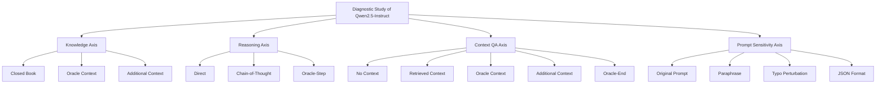

# What Limits Small Language Models? A Diagnostic Study of Qwen2.5-Instruct

[](https://dn.fpt.edu.vn)
[](https://github.com/QwenLM/Qwen2.5)

This repository contains the official codebase, datasets, evaluation scripts, and analysis notebooks for the paper: **"What Limits Small Language Models? A Diagnostic Study of Qwen2.5-Instruct"**.

> 📝 **Authors:** Le Ho Anh Duy, Dang Quang Nhat, Pham Minh Tien, and Luong Vuong Nguyen  
> 🏫 **Affiliation:** Faculty of Artificial Intelligence, FPT University, Da Nang, Vietnam  
> ✉️ **Contact:** `{lehoanhduy5426, dangquangnhat1504, taxaceae.forwork}@gmail.com`, `vuongnl3@fe.edu.vn`

---

## 📌 Abstract

Small language models (SLMs) are useful when memory, cost, or latency is limited, but a low score does not explain why a model failed. It may lack facts, make logical mistakes, ignore relevant evidence, or respond poorly to prompt wording. 

We study these failure modes with a **simple paired-intervention design** on three Qwen2.5-Instruct models (1.5B, 3B, and 7B). Across **45,000 deterministic generations**, we compare each normal setting with a matched support setting:
1. Adding the answer as external knowledge
2. Giving a useful intermediate reasoning step
3. Replacing retrieved evidence with gold evidence
4. Changing the prompt form

**Key Findings:**
* **Chain-of-thought (CoT)** prompting helps, but providing an **oracle intermediate step** helps much more, especially for the 7B model.
* **External knowledge** and **high-quality context** remain highly useful even as models scale.
* **Prompt form** can significantly help or hurt performance (e.g., JSON-formatting heavily degrades performance on smaller models).
* Scaling alone is not a substitute for retrieval quality, evidence selection, or careful prompting.

---

## 🛠️ Paired Intervention Framework

Our study evaluates the models across four diagnostic axes with 15 specific conditions:



### Prompt Templates
All prompt templates used in these 15 diagnostic conditions are documented in detail in the [appendix.md](file:///C:/Users/Administrator/MAIN/FPT_AIO20A02/SM26/TMG301/what-limits-small-language-models/appendix.md) file.

---

## 📊 Experimental Results

### 1. Knowledge Axis (TriviaQA - Token F1)
Provides a short reference sentence containing the gold answer vs. closed-book.

| Model Size | Closed-Book | Oracle | Additional Context | Oracle $-$ Closed Delta | Additional $-$ Oracle Delta |
| :--- | :---: | :---: | :---: | :---: | :---: |
| **Qwen2.5-1.5B** | 0.310 | 0.815 | 0.796 | **+0.505** | -0.019 |
| **Qwen2.5-3B**   | 0.419 | **0.824** | **0.955** | +0.405 | +0.130 |
| **Qwen2.5-7B**   | **0.466** | 0.724 | 0.933 | +0.258 | **+0.209** |

### 2. Reasoning Axis (GSM8K - Accuracy)
Direct answering vs. Chain-of-Thought (CoT) vs. Oracle intermediate step.

| Model Size | Direct | CoT | Oracle-Step | CoT $-$ Direct Delta | Oracle-Step $-$ Direct Delta |
| :--- | :---: | :---: | :---: | :---: | :---: |
| **Qwen2.5-1.5B** | **0.320** | 0.396 | 0.708 | +0.076 | +0.388 |
| **Qwen2.5-3B**   | 0.268 | 0.493 | 0.767 | +0.225 | +0.499 |
| **Qwen2.5-7B**   | 0.269 | **0.535** | **0.909** | **+0.266** | **+0.640** |

### 3. Context QA Axis (HotpotQA-Distractor - Token F1)
Evaluating the impact of retrieval vs. oracle context.

| Model Size | None | Retrieved | Oracle | Additional | Oracle-End |
| :--- | :---: | :---: | :---: | :---: | :---: |
| **Qwen2.5-1.5B** | 0.175 | 0.352 | 0.523 | 0.541 | 0.492 |
| **Qwen2.5-3B**   | 0.254 | 0.456 | **0.701** | 0.636 | 0.661 |
| **Qwen2.5-7B**   | **0.280** | **0.522** | 0.613 | **0.680** | **0.673** |

### 4. Prompt Sensitivity / Robustness Axis (GSM8K-Derived - Accuracy)
Sensitivity to prompt modifications.

| Model Size | Original | Paraphrase | Typo | JSON Format |
| :--- | :---: | :---: | :---: | :---: |
| **Qwen2.5-1.5B** | 0.043 | 0.051 | 0.033 | 0.027 |
| **Qwen2.5-3B**   | 0.093 | 0.137 | 0.085 | 0.003 |
| **Qwen2.5-7B**   | **0.100** | **0.176** | **0.115** | **0.068** |

---

## 📂 Repository Structure

The project codebase is organized as follows:

```
what-limits-small-language-models/
├── .agent/                    # Agent temporary run configurations (git-ignored)
├── QWEN2.5-merged-outputs/    # Merged experimental inference outputs (git-ignored)
├── combo_latex/               # LaTeX source & pdf artifact of the paper (git-ignored)
│   └── latex.pdf              # Compiled PDF of the paper
├── scripts/                   # Auxiliary Python utility scripts
│   ├── check_local_outputs.py
│   ├── check_prepared_data.py
│   ├── extract_qualitative_examples.py
│   ├── merge_robustness_into_merged_outputs.py
│   ├── rebuild_local_first_notebooks.py
│   ├── redraw_paper_figures.py
│   ├── replot_merged_outputs.py
│   ├── test_experiment_runner.py
│   └── test_smoke_extraction.py
├── 00-prepare-data.ipynb      # Notebook: Data preparation
├── 01-smoke-test.ipynb        # Notebook: Small-scale sanity runs
├── 02-run-experiment.ipynb    # Notebook: Main evaluation script
├── 06-merge-evaluate-plot.ipynb # Notebook: Statistical evaluation and plotting
├── kaggle-qwen2p5-1.5b-end-to-end copy.ipynb
├── kaggle-qwen2p5-3b-end-to-end.ipynb
├── kaggle-qwen2p5-7b-end-to-end.ipynb
├── appendix.md                # Diagnostic prompt templates reference
├── README.md                  # Main repository README
└── .gitignore                 # Configured to ignore local datasets, PDFs and outputs
```

---

## 🚀 How to Run the Experiments

### 1. Requirements & Setup
Make sure you have python 3.8+ and Jupyter installed. Install the requirements (mostly `transformers`, `torch`, `datasets`, and plotting packages like `matplotlib` or `seaborn`):
```bash
pip install torch transformers datasets pandas matplotlib seaborn jinja2
```

### 2. Run Pipeline Steps
Follow the sequence of notebooks to recreate the paper's experiments:
1. **Data Preparation**: Run [00-prepare-data.ipynb](file:///C:/Users/Administrator/MAIN/FPT_AIO20A02/SM26/TMG301/what-limits-small-language-models/00-prepare-data.ipynb) to download and preprocess TriviaQA, GSM8K, and HotpotQA.
2. **Smoke Test**: Run [01-smoke-test.ipynb](file:///C:/Users/Administrator/MAIN/FPT_AIO20A02/SM26/TMG301/what-limits-small-language-models/01-smoke-test.ipynb) to verify that local model inference functions correctly.
3. **Run Full Experiments**: Execute [02-run-experiment.ipynb](file:///C:/Users/Administrator/MAIN/FPT_AIO20A02/SM26/TMG301/what-limits-small-language-models/02-run-experiment.ipynb) (or use the Kaggle notebooks) to complete inference across 15 diagnostic settings.
4. **Evaluation & Plotting**: Use [06-merge-evaluate-plot.ipynb](file:///C:/Users/Administrator/MAIN/FPT_AIO20A02/SM26/TMG301/what-limits-small-language-models/06-merge-evaluate-plot.ipynb) to aggregate outputs and reproduce figures in the paper.

---

## 🎓 Citation

If you find this work useful in your research, please cite our paper:

```bibtex
@article{le2026limits,
  title={What Limits Small Language Models? A Diagnostic Study of Qwen2.5-Instruct},
  author={Le, Ho Anh Duy and Dang, Quang Nhat and Pham, Minh Tien and Nguyen, Luong Vuong},
  journal={arXiv preprint},
  year={2026}
}
```
